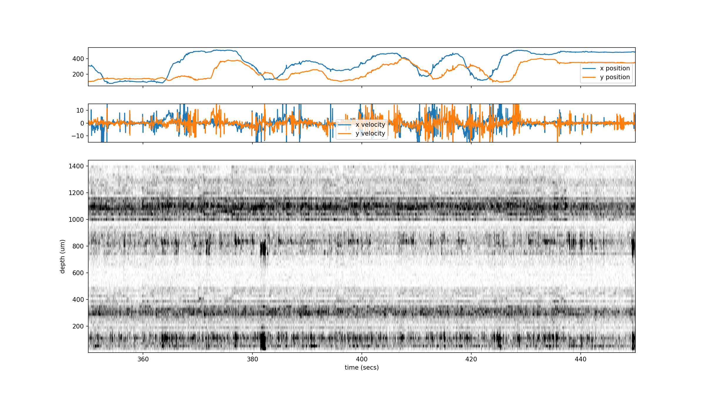

# Experimental data from Neuropixel group

The datasets acquired during the 2025 course are available at:

[https://ibl-brain-wide-map-public.s3.amazonaws.com/index.html#spikesorting/cajal_2025/](https://ibl-brain-wide-map-public.s3.amazonaws.com/index.html#spikesorting/cajal_2025/)

The direct link for s3 access is:

[s3://ibl-brain-wide-map-public/spikesorting/cajal_2025](s3://ibl-brain-wide-map-public/spikesorting/cajal_2025)

The scripts provide basic pre-processing:
1. compression of raw dta
2. launching the spike sorting with parameters for high-frequency noise
3. synchronize with the video recording, and display a raster plot with movement information:

